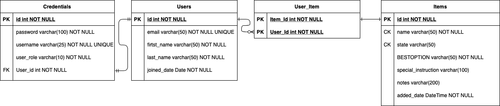

# Per Scholas - Case Study
**Deliver a Java web application created using Spring MVC or Spring Boot**  
Below is the description of the project.

---

# What Goes Where in Redmond
- To search how to dispose of anything in Redmond, WA, USA
- Users can also participate in growing the knowledge by adding more items!

## Technical Specifications
A Java web application built using Spring MVC framework
- Java 11
- Apache Maven
- Web server: Tomcat v9.0
- Framework: Spring MVC v5.3.8
- Session management: Spring Security v5.5.1
- Database: MariaDB v2.6.2
- Eclipse Link (JPA) v2.7.6
- Javax Validation v2.0.1 Final
- JSTL v1.2
- Mockito v3.2.4
- JUnit v1.6.2
- Jupiter v5.7.2
- Selenium v3.4.0
- JavaMail v1.6.2

## JPA
- `persistence.xml` includes model classes, JDBC connection information, and Eclipse Link configurations
- Custom queries: 
    - `CredentialRepository`
       - `findByUsername`
    - `ItemRepository`
       - `findByName`
    - `UserRepository`
       - `findByEmail`
    - `UserItemRepository`
       - `deleteByItemId`
       - `deleteByUserId`

## Model (`@Entity`)
- `Credential`: username, password, user role. `@OneToOne` to `User`
- `User`: email, first name, last name, items, joined date
- `Item`: name, condition, best option, special instruction, notes, added date
- `UserItem` (Join Table): `User` to `Item` is mapped with `@OneToMany` relationship

## View (`@Service`)
Implemented via `@Autowired` repositories (`@Repository`)
- `CredentialServiceImpl`
- `UserServiceImpl`
- `ItemServiceImpl`
- `UserItemServiceImpl` (Join Table)
- `EmailServiceImpl` (For JavaMail)
- `UserDetailsServiceImpl` (For Spring Security)

## Controller (`@Controller`)
- `HomeController`: Handles mappings for public access page
- `CredentialController`: Handles mappings related to CredentialService
- `EmailController`: Handles mappings related to EmailService
- `ItemController`: Handles mappings related to ItemService
- `UserController`: Handles mappings related to UserService

## Custom Exceptions
- `CredentialAlreadyExistsException`: thrown at `Credential`'s `add()` method
- `CredentialNotFoundException`: thrown at `findByNameAndPassword()` and `update()` methods
- `ItemAlreadyExistsException`: thrown at `add()` and `update()` methods

## JUnit Testing
Tests all methods in each Service class.
- For `CredentialService`
    - `CredentialServiceIT`: Integrated Test 
       - `CredentialAlreadyExistsException` is tested with `add()` method
       - `CredentialNotFoundException` is tested with `findByUsernameAndPassword()` method
- For `UserService`
    - `UserServiceIT`: Integrated Test 
    - `UserServiceMockitoTest`:  Mockito Test 
- For `UserItemService`
    - `UserItemServiceIT`: Integrated Test
- For `ItemService` 
    - `ItemParameterizedTest`: Parameterized Test 
    - `ItemServiceMockitoTest`: Mockito Test
    - `ItemServiceTestSuite`: Test Suite for `ItemParameterizedTest` and `ItemServiceMockitoTest`
    - `ItemServiceIT`: Integrated Test 
       - `ItemAlreadyExistsException` is tested for `add()` method 
- Selenium
    - Tested login, profile view, and admin login.
    
## Views (Front-end)
- JSP (16 pages): about, access_denied, add_item, admin, contact_success, contact, delete_user, edit_item, error, index, list, login, logout_success, profile, register, update_password
- CSS
    - custom external file: `stylesheet.css`
    - Bootstrap
    - internal styling
- Javascript
    - `add_table_head.js`: adds table head when showing search results in the main page
    - `go_back.js`: links the previous page to a button
    - internal scripts to change headers and footers depending on roles
- Navigation
    - `header.jsp` and `footer.jsp` are included in every JSP
    
## Spring Security
- `Credential` class holds username, password, and user's role.
- `CurrentCredential` class holds Credential in the current session.
- Anonymous user can access index, find, about, list, login, register, logout_success, contact, and contact_success page. 
- `ROLE_USER` can additionally access profile, add_item, edit_item, delete_user, update_password, access_denied, and error page.
- `ROLE_ADMIN` can additionally access admin page.

## Utility classes
- `BestOption`: an enum class containing 4 different disposal options for Users to choose from
- `ControllerUtilities`: a utility class containing model attribute names and methods to retrieve current user information
- `ModelUtilities`: a utility class containing name and queries of Named Queries 
- `PageName`: an enum class containing HTML page names
- [ ] URL patterns

## User Stories
- As a user, I want to search for an item so that I can get information on how to dispose of it. (R)
- As a user, I want to see a list of all items this website has so that I can look into similar items that I’m trying to search. (R)
- As a user, I want to create an account on this website so that I can keep track of my contribution to the website. (C)
- As a user, I want the register form to be populated when my username already exists and the page is refreshed.
- As a user, I want to log in to the website so that I can check my account information.
- As a user, I want to see a list of items that I’ve added to the website on my profile page so that I can keep track and manipulate the items easily. (R)
- As a user, I want to sign out so that my credentials are securely removed from the browser.
- As a user, I want to add a new item to the website’s list so that I can search for the same item later. (C)
- As a user, I want to have options to choose from for "best option" category when adding/editing an item.
- As a user, I want to be warned when adding a new item so that I don't add a duplicate item.
- As a user, I want to modify items that I have added to the website so that I can update incorrect information. (U)
- As a user, I want to go back from update item page to the profile page so that I can change my mind if I want to.
- As a user, I want to delete items that I have added to the website so that I can remove unrelated information. (D)
- As a user, I want to delete my account so that I stop using the service. (D)
- As a user, I want to change my password (U)
- As a user, I want to contact the support team so that I can share my opinions and make suggestions to the website. (Email functionality)
- As an admin, I want to see all the users. (R)
- As a user, I want to see the entire list sorted in alphabetical order with navigation for each letter so that I can look for items faster and I don’t have to scroll up and down the web page too much. (Bootstrap)
- [ ] As a user, I want to expect the same user interface experience regardless of which devices I’m using. (CSS)

## Technical Challenges
- In One-To-Many relationship between User and Item, deleting a User or Item row won't cascade to the join table
    - Resolution: Manually deleted the join table row first and delete the actual model table row.
- Forwarding model attribute across methods in different controllers won't work.
    - Resolution: Added the attributes to RedirectAttribute object's flash attribute and redirect to the desired path.
- Adding enum object to the database won't resolve to a valid type
    - Resolution: Created a class for attribute converter that converts between enum object and database column
- Fixing header and footer to top and bottom of the viewport
    - Resolution: Made the `<body>` a column flex box, the main container `<section>` auto flex, and `<header>` and `<footer>` no flex.
- Item table becomes very long with a large number of data
    - Resolution: Imported DataTables to format the table with pagination, sort, and search function.